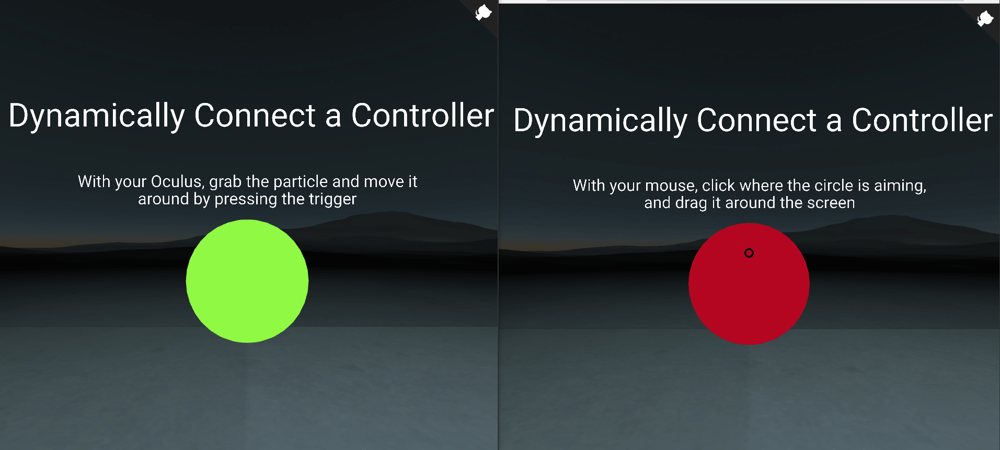

## aframe-responsive-component

[](https://npmjs.org/package/aframe-responsive-component)
[](https://npmjs.org/package/aframe-responsive-component)

Brings  responsive design based on the user&#39;s controller. Dyanmically sets attributes (or components) to entities based on the current connected controller.

For [A-Frame](https://aframe.io).


<p style="text-align:center;"><i>Same code, different output depending on the connected device. Works with most components and attributes.</i></p>


This is akin to media queries, but with the controllers. This component listens to controller connection, and sets a property according to the supported type of controller (Oculus Touch, Vive, Daydream, Mixed Reality, Gaze).

This means that you can tailor specific experiences to each one of the devices without rewriting your code. From tutorials to how the world is laid out. 

This works really well with <a href="https://github.com/wmurphyrd/aframe-super-hands-component">super-hand-components</a>.


### API

| Property | Type | Description | Default Value |
| -------- | ----------- | ------------- |------------- |
| controller | Mandatory | An `<a-entity>` or element that holds the controller, which the component will call 'controllerconnected' and 'controllerdisconnected' properties. This can be used (and is recommended) to target <a href="https://github.com/wmurphyrd/aframe-super-hands-component#progressive-controls-component">progressive-controls</a> |  No default. Must be used. |
| _default         | Mandatory | An Array of properties that sets the a pair of attributes and their respective values to the current component. This is the one which will work with **gaze** This will be the main fallback mechanism in case other controllers aren't specified.               | No default. Must be used. |
|daydream | Optional | Array of properties to be set when the daydream controller is connected. | The array of properties you specified in _default |
|oculus | Optional | Array of properties to be set when the oculus-touch controller is connected. | The array of properties you specified in _default |
|vive | Optional | Array of properties to be set when the HTC Vive controller is connected. | The array of properties you specified in _default |
|gearvr | Optional | Array of properties to be set when the GearVR controller is connected. | The array of properties you specified in _default |
|windows | Optional | Array of properties to be set when a Windows Mixed Reality controller is connected. | The array of properties you specified in _default |
|[{"attr": "myComponent", "value": ["myComponent's Value"]}] | Mandatory | This is the key-value pair of each of the properties specified above. <br/><br/><br/><span style="color:#f44336">Important!</span> Each key-value pair **must be enclosed in double quotes or it won't work**. Don't use semicolon `;` inside "value"; have them in separate strings instead!| No defaults. Must be used |


### How to use:

This works by passing a JSON Array to the component, parsing it, and then listening for each `controllerconnected` and `controllerdisconnected` events, and setting it for the right controller. You **must** pass it with the form of:

```html
<a-entity responsive='controller:.controller ; _default:[{"attr": "myComponent", "value": ["myComponent\'s Value"]}]'></a-entity>
```

#### Notes and important details:
* `_default` was used instead of `default` because the latter was conflicting with A-Frame when reading the component's schema.
* You must use double quotes `""` for the key and value. Single quotes `''` will not work
* Do not use semicolon `;` to put multiple properties inside the value key from the array. Doing so will not parse correctly. Ex: [{"attr": "geometry", "value": ["primitive:box; height:0.5;"]}]. Correct: [{"attr": "geometry", "value": ["primitive:box", "height:0.5"]}] (Note: no `;` to separate the component's values.)
* Do not put a trailing comma at the last object in the array Ex: [{"attr": "myComponent", "value": ["myComponent's Value"]},] (Check the last comma), this will not parse correctly. 
* Think as of valid JSON that needs to be passed as [{"attr": "myComponent", "value": ["myComponent's Value"]}] 


### Installation

#### Browser

Install and use by directly including the [browser files](dist):

```html
<head>
  <title>My A-Frame Scene</title>
  <script src="https://aframe.io/releases/0.7.1/aframe.min.js"></script>
  <!-- super-hands; not needed, but recommended -->
  <script src="https://unpkg.com/super-hands@2.1.0/dist/super-hands.min.js"></script>
  <!-- The component -->
  <script src="https://unpkg.com/aframe-responsive-component@0.1.0/dist/aframe-responsive-component.min.js"></script>
</head>

<body>
  <a-scene>
    <!-- progressive-controls, not needed but recommended -->
     <a-entity progressive-controls="objects:.obj" class="controller">
        <a-entity id="rhand"
          class="right-controller" collision-filter="collisionForces: false" >
        </a-entity>
        <a-entity id="lhand"
          class="left-controller" collision-filter="collisionForces: false">
        </a-entity>
      </a-entity>

    <!-- Where the magic happens -->
    <!-- Oculus will overwrite default when an oculus touch controller is connected. 
        If any other controller is connected, it will use its property instead
    -->
      <a-entity
      class="obj"
      responsive='controller: .controller;
                  _default:[{"attr":"geometry", "value":["primitive:sphere","radius:0.2"]}];

                  oculus:[{"attr" : "geomtry", "value" : ["primitive:box", "height:0.1"]}
                         {"attr" : "material", "value" : ["color:#00BCD4"]}];'></a-entity>
  </a-scene>
</body>


```


<!-- If component is accepted to the Registry, uncomment this. -->
<!--
Or with [angle](https://npmjs.com/package/angle/), you can install the proper
version of the component straight into your HTML file, respective to your
version of A-Frame:

```sh
angle install aframe-responsive-component
```
-->

#### npm

Install via npm:

```bash
npm install aframe-responsive-component
```

Then require and use.

```js
require('aframe');
require('aframe-responsive-component');
```
